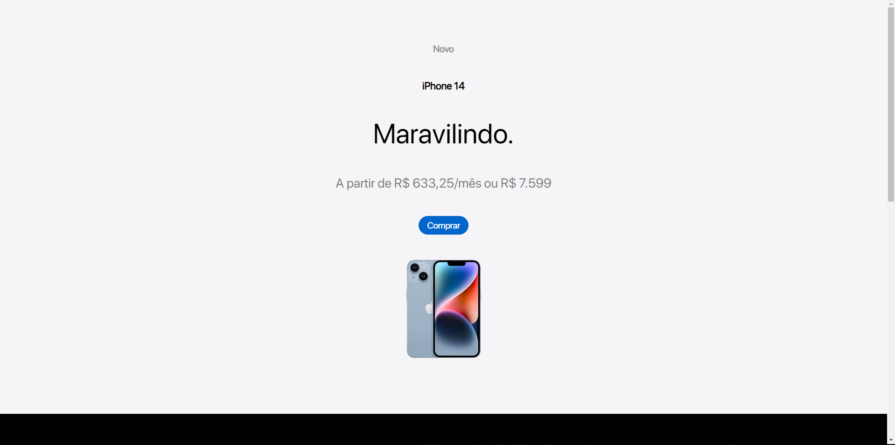

<h1 align="center">
    Apple Market 🛒
</h1>

https://github.com/valdircaf/appleMarket/assets/70548483/be66602f-991b-44d1-8b5e-8afcd3248532

<h1>
    <video width="320" height="520">
        <source src="https://github.com/valdircaf/appleMarket/assets/70548483/e1452700-acd1-4cb8-8cc6-503410f3ff70"/>
    </video>
</h1>

<h1>
    
</h1>

## 📚 Sobre

O Apple Market vem como uma réplica do sistema de compras original da Apple. Ele conta com 3 páginas interativas, sendo elas: **Home**, **Página de escolha de produtos** e **Página de carrinho**, chegando finalmente na página de conclusão de compra.

## 🛠️ Tecnologias

- React.js
- Javascript
- SCSS
- Context Hook(Hook do React.js)

```bash
    # Para clonar o projeto
    $ git clone git@github.com:valdircaf/appleMarket.git
```

```bash
    # Entrar no diretório
    $ cd apple2
```

```bash
    # Instalar as dependências
    $ npm install
```

## 📄 License
Este projeto possui uma licença MIT. Para mais detalhes, [Acessar Licença](https://github.com/valdircaf/appleMarket/blob/main/LICENSE).

## 🔗 Link
O projeto está disponível para testes no link abaixo:
[Acessar site](https://apple-market-liard.vercel.app/)
